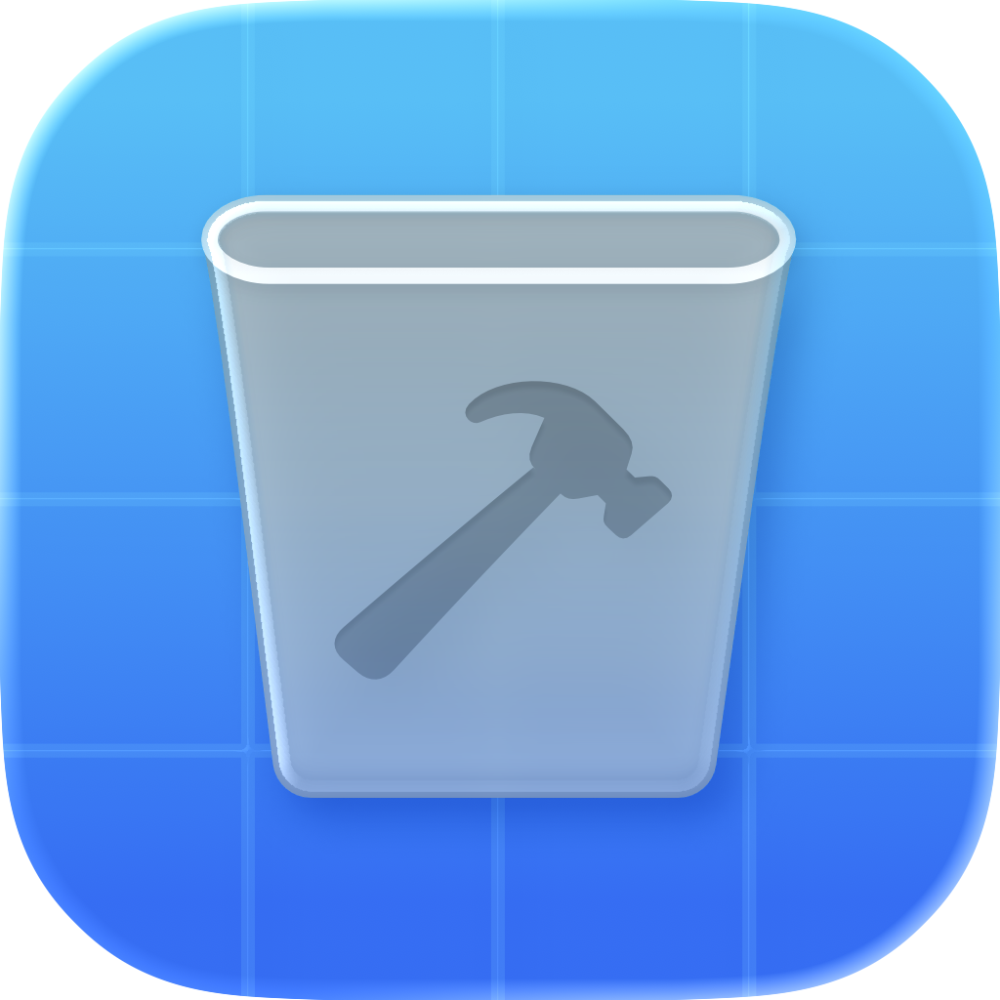
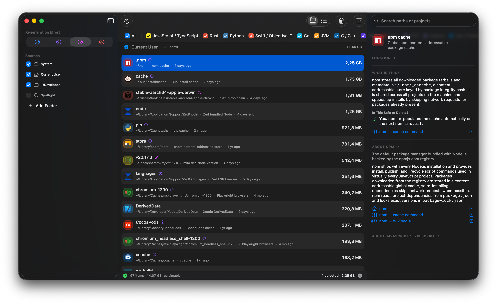

# Cruft

<p align="center">

</p>

Cruft is a native macOS (26.x+) app for **finding and removing temporary, derived and toolchain files** created by various development tools.

## Motivation

If, like me, you're constantly trying out different languages, tools, projects, package managers, IDEs, runtimes and compilers, you can easily end up accruing tens or even hundreds of gigabytes of cruft on your machine.

Traditional cleanup tools like [DaisyDisk](https://daisydiskapp.com/) are very good at finding large files and folder subtrees, but don't help much when it comes to cleaning up all the scattered small files that build up over time.

Additionally, you might want to learn what the specific paths are, what ecosystem they belong to, and whether they require specific cleanup commands or can just be trashed.

## What it looks like



## Features

- Locates files created by 20+ popular ecosystems — see [Supported ecosystems](#supported-ecosystems) below
- Ranks files by regeneration effort/time, so you can choose the depth of cleanup desired
- Provides instructive explanations about each location, tool, language and ecosystem with documentation references
- Runs appropriate cleanup scripts where applicable
- Custom scanner + Spotlight fallback
- Auto-detects common developer roots, (e.g. `~/Developer`, `~/Projects`, `~/Code`, ...)
- Supports system, user and project-local cleanup

## Supported ecosystems

- **JavaScript / TypeScript** — Node.js, npm, pnpm, yarn, bun, Vite, Parcel, Turborepo, Next.js, Nuxt, Svelte, Astro, Electron, plus version managers (nvm, fnm, n, asdf)
- **Rust** — rustup, cargo registry / git / target caches
- **Python** — pip, uv, poetry, pyenv, virtualenv, `__pycache__`
- **Swift / Objective-C** — Xcode (DerivedData, archives, KDKs, device support), SwiftPM, CocoaPods / Carthage, simulators (devices and runtimes)
- **Go** — module cache, build cache
- **JVM** — Maven, Gradle
- **C / C++** — CMake, ccache
- **.NET** — NuGet, `bin` / `obj`, OmniSharp
- **Ruby** — RubyGems, Bundler, rbenv, RVM, chruby, asdf
- **PHP** — Composer, vendor directories
- **Haskell** — Cabal, Stack, ghcup
- **Dart / Flutter** — Flutter SDK, pub, `.dart_tool`
- **Elixir / Erlang** — Mix, Hex, rebar3
- **Other languages** — Zig, D, Crystal, Nim, OCaml, Julia, R
- **Bazel** — output base / disk cache
- **Homebrew / MacPorts / Nix** — download caches, old formula versions, Nix garbage collection
- **Static site generators** — Hugo, Jekyll, Zola, MkDocs, Pelican, Eleventy, Hexo, Gatsby, Docusaurus
- **Editors & IDEs** — VS Code (+ Insiders), Cursor, Zed, JetBrains, Neovim (+ coc-nvim, mason), Emacs (+ Doom Emacs), Sublime Text, Helix, Nova, plus language servers (rust-analyzer, sourcekit-lsp, jdtls)
- **Local AI & ML** — Ollama, LM Studio, Jan, Hugging Face, InvokeAI, DiffusionBee, PyTorch, TensorFlow, Keras, fastai, MLX, Ultralytics
- **Browser automation** — Playwright, Cypress, Puppeteer (bundled Chromium / Firefox / WebKit binaries)
- **VMs & containers** — Docker Desktop, Tart

## Dev instructions

### Requirements

- macOS 26
- Xcode 26 (provides `swift`, `actool`, `codesign`)

### Build & run

```sh
./build.sh           # release build
open build/Cruft.app
```

Pass `debug` for a debug build: `./build.sh debug`.

## License

[MIT](LICENSE) © 2026 Prelude LTDA.

## Credits

Brand logos under `Resources/Logos/` — see
[`Resources/Logos/CREDITS.md`](Resources/Logos/CREDITS.md).
